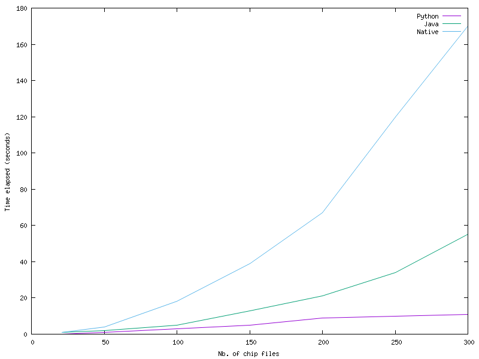
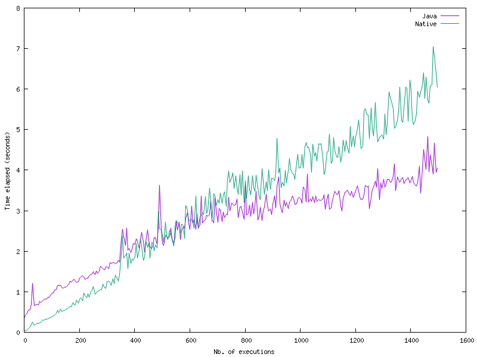

# SVGpinout-java

This project is a Java port of the Python project [SVG pinout generator](https://github.com/neogeodev/SVGPinout)
with some small improvements:
- pin size is augmented if the pin name length is more than 8 characters
- power color for V+, Vdd...
- GND pin is black with a white text
- new pin type: **ANALOG**
- several new options

A chip package file is a CSV file that has the following structure:
- first line: Chip name, Output file name, Package, Logo file name
- pin lines: Pin name, Type, Direction (IN, OUT, BIDIR, or nothing)

The pin lines equals the number of the pins defined in package file.

---------

In addition to porting the code to Java, I just wanted to see how perform the Java version
in comparison with the Python version using [Graal VM](https://www.graalvm.org/).
I also compared the native  executable with the Python and Java versions.

## Building the project
1. [Graal VM](https://www.graalvm.org/) or [Liberica Native Image Kit](https://bell-sw.com/pages/downloads/native-image-kit/#nik-25-(jdk-25))
variant, version >= 25
2. The environment variable `GRAALVM_HOME` defined
3. [Maven](https://maven.apache.org/) version >= 3.6.3

### Checking requirements
- dependencies versions checking: `mvn versions:display-dependency-updates`
- plugins version checking: `mvn versions:display-plugin-updates`

### Building the executable
To create the executable jar please run `mvn -U clean package`

To compile to a native executable:
```shell
$ mvn -U clean package -P native-simple -DskipTests
```

With [GraalVM](https://graalvm.org) an optimized version may be build with
`mvn -U clean package -P native -DskipTests` if a **default.iprof** file exists;
this file may be created with the `graal-instrument` profile.

There is also defined in **pom.xml** a `native-liberica` profile as options differ from Graal.

To generate the file `reachability-metadata.json` one should use
```shell
$ ${GRAALVM_HOME}/bin/java \
  -agentlib:native-image-agent=config-output-dir=src/main/resources/META-INF/native-image/svgpinout/svgpinout/ \
  -jar target/svgpinout.jar <pinout csv file>
```
Please also read [GraalVM Native Image Agent — reachability metadata: how to run it, where files go](https://dev.to/ozkanpakdil/graalvm-native-image-agent-reachability-metadata-how-to-run-it-where-files-go-45c1)

## Running the artifacts
To run the executable jar:
```shell
$ java -jar target/svgpinout-jar-with-dependencies.jar <csv file>
```
or the native binary:
```shell
$ target/svgpinout <csv file>
```

The following options are supported:
- **-o** | **--outdir** `<outdir>` = SVG file output directory(otherwise the current folder will be used)
- **-l** | **--logodir** `<logodir>` = alternate logos directory (if a new chip requires it)
- **-n** | **--nologo** = no logo embedded in the SVG file (useful for comparison with the Python version that does not insert the logo)
- **-p** | **--packages** `<alternate packages.csv file>` = if you have a new package, you may describe it here
- **-d** | **--display** = display embedded **packages.csv** content
- **-b** | **--loop** = run in loop (useful to see if there are memory leaks)
- **-r** | **--repeat** <# of times> (should be > 0)
- **-s** | **--statistics** = display some statistics after finishing the program execution
- **-h** | **--help** = display this help

To display more debug messages, add the option `-Dorg.slf4j.simpleLogger.defaultLogLevel=debug`.
Other options for `SLF4J simple`:
- `-Dorg.slf4j.simpleLogger.showDateTime=true`
- `-Dorg.slf4j.simpleLogger.dateTimeFormat="H:m"`
- `-Dorg.slf4j.simpleLogger.levelInBrackets=true`
More parameters at [SimpleLogger](https://www.slf4j.org/api/org/slf4j/simple/SimpleLogger.html).


The **-b** option enable running the application in a loop; using startup options
```shell
-Dcom.sun.management.jmxremote -Dcom.sun.management.jmxremote.port=5550
-Dcom.sun.management.jmxremote.rmi.port=5550
-Dcom.sun.management.jmxremote.ssl=false
-Dcom.sun.management.jmxremote.authenticate=false -Djava.rmi.server.hostname=127.0.0.1
```
one could use **jconsole** in order to display memory consumption etc...

## Benchmarks

Comparing Python (3.12.3), Java and native (on an Ubuntu 24.04 Linux system) was done on a folder containing 300 fake CSV chip files and using the script [benchmark.sh](src/main/shell/benchmark.sh)
 - the result is 
Surprisingly, the Python version is the fastest and the native the slowest!

Comparing only the Java jar and native versions (by running the application up to 1500 times on the same file) using the [plot-java_native.sh](src/main/shell/plot-java_native.sh) script one may notice that native version is faster for about 500
loops - after, running `java -jar` is faster!



I cannot explain the results, unless if my scripts are somehow flawed!
